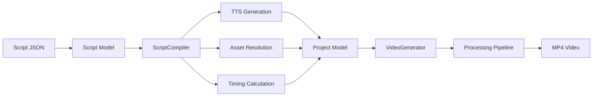

# Teto プロジェクト - 全体概要

## プロジェクト概要

**Teto** は解説・チュートリアル動画を自動生成するための包括的なビデオ生成システムです。AI フレンドリーな高レベル API と強力な低レベル制御機能を組み合わせ、シンプルなスクリプトから複雑な動画制作まで対応します。

### 主な特徴

- 📝 **JSON ベースの台本システム**: AI が生成しやすい構造化されたスクリプト形式
- 🎙️ **マルチ TTS プロバイダー**: Google Cloud TTS、ElevenLabs、Gemini に対応
- 🎨 **AI 画像生成**: Stability AI による自動画像生成
- 🎬 **豊富なエフェクト**: フェード、スライド、ズーム、Ken Burns など
- 📱 **マルチプラットフォーム出力**: YouTube、TikTok、Instagram を同時生成
- 💾 **インテリジェントキャッシュ**: TTS 音声と生成画像を自動キャッシュ
- 🔌 **拡張可能なアーキテクチャ**: カスタムエフェクト、TTS プロバイダー、プロセッサーを追加可能

---

## プロジェクト構造

```
teto/
├── packages/                # Python & Node.js パッケージ
│   ├── core/               # コア動画生成ライブラリ (Python)
│   │   └── teto_core/
│   │       ├── script/     # スクリプトモデル（高レベル API）
│   │       ├── project/    # プロジェクトモデル（実行モデル）
│   │       ├── layer/      # レイヤーモデル（映像、音声、字幕）
│   │       ├── effect/     # エフェクトシステム
│   │       ├── tts/        # TTS プロバイダー
│   │       ├── generator/  # 動画生成パイプライン
│   │       ├── cache/      # キャッシュ管理
│   │       └── ...
│   ├── api/                # FastAPI サーバー (Python)
│   ├── cli/                # CLI ツール (Python)
│   └── lib/                # TypeScript ライブラリ
├── apps/
│   └── desktop/            # Electron デスクトップアプリ
├── examples/               # サンプルスクリプト・プロジェクト
└── docs/                   # ドキュメント
    └── design/             # 設計ドキュメント（このディレクトリ）
```

---

## アーキテクチャの階層

Teto のアーキテクチャは 3 つの主要な層で構成されています：

### 1. スクリプト層（高レベル API）

**目的**: AI や人間が簡単に記述できる抽象的な表現

```
Script (台本)
├── scenes: シーンのリスト
│   ├── narrations: ナレーションテキスト
│   ├── visual: 映像指定（パスまたは AI 生成）
│   └── voice: 音声設定（オプション）
├── voice: グローバル音声設定
├── voice_profiles: 名前付き音声プロファイル
├── timing: タイミング設定
├── bgm: BGM 設定
└── output: 出力設定
```

**特徴**:
- JSON で簡単に記述可能
- AI が生成しやすい構造
- 複雑な詳細は隠蔽
- Pydantic によるバリデーション

### 2. プロジェクト層（実行モデル）

**目的**: 動画レンダリングエンジンが実行する低レベル表現

```
Project (プロジェクト)
├── timeline: タイムライン
│   ├── video_layers: 映像レイヤーリスト
│   ├── audio_layers: 音声レイヤーリスト
│   ├── subtitle_layers: 字幕レイヤーリスト
│   └── stamp_layers: スタンプレイヤーリスト
└── output: 出力設定（パス含む）
```

**特徴**:
- 実行に必要な全情報を含む
- タイミング情報が具体化
- レイヤー単位で制御可能

### 3. 生成層（レンダリングパイプライン）

**目的**: プロジェクトから実際の動画ファイルを生成

```
VideoGenerator
├── Pipeline: 処理ステップのチェーン
│   ├── VideoLayerProcessing: 映像レイヤー処理
│   ├── AudioLayerProcessing: 音声レイヤー処理
│   ├── AudioMerging: 音声合成
│   ├── StampLayerProcessing: スタンプ追加
│   ├── SubtitleProcessing: 字幕処理
│   ├── VideoOutput: 動画出力
│   └── Cleanup: リソース解放
└── Processors: 各レイヤータイプの処理ロジック
```

**特徴**:
- パイプライン方式で拡張可能
- ステップ単位でカスタマイズ可能
- Pre/Post フックで処理を挿入可能

---

## データフロー

### Script → Project → Video



### 詳細なフロー

1. **入力**: Script JSON ファイル
2. **バリデーション**: Pydantic による型チェック
3. **コンパイル**:
   - TTS 音声生成（キャッシュあり）
   - アセット解決（ローカルまたは AI 生成）
   - タイミング計算
   - レイヤー構築
4. **生成**:
   - 映像レイヤー処理（リサイズ、エフェクト）
   - 音声レイヤー処理（ナレーション、SE、BGM）
   - 字幕処理（焼き込みまたはエクスポート）
   - 動画出力（MP4 エンコード）
5. **出力**: MP4 動画 + 字幕ファイル（オプション）

---

## 主要コンポーネント

### 1. Script System (`teto_core/script/`)
- **models.py**: Script、Scene、VoiceConfig などのデータモデル
- **compiler.py**: Script → Project 変換ロジック
- **providers/**: TTS プロバイダー、アセット解決
- **presets/**: シーンプリセット（エフェクト設定の再利用）

### 2. Project System (`teto_core/project/`)
- **models.py**: Project、Timeline、OutputConfig

### 3. Layer System (`teto_core/layer/`)
- **models.py**: VideoLayer、AudioLayer、SubtitleLayer、StampLayer
- **processors/**: 各レイヤータイプの処理ロジック

### 4. Effect System (`teto_core/effect/`)
- **models.py**: AnimationEffect、TransitionConfig
- **processors.py**: エフェクトレジストリと適用ロジック
- **strategies/**: 個別エフェクト実装（Strategy パターン）

### 5. TTS System (`teto_core/tts/`)
- **models.py**: TTS リクエスト・レスポンスモデル
- **google_tts.py**: Google Cloud TTS クライアント
- **gemini_tts.py**: Gemini TTS クライアント
- **elevenlabs_tts.py**: ElevenLabs クライアント

### 6. Generator System (`teto_core/generator/`)
- **video_generator.py**: メイン生成エンジン
- **pipeline.py**: パイプライン抽象クラス
- **steps/**: 処理ステップ実装
- **context.py**: 処理コンテキスト

### 7. Cache System (`teto_core/cache/`)
- **base.py**: 基底キャッシュマネージャー
- **tts.py**: TTS キャッシュ
- **unified.py**: 統合キャッシュマネージャー

---

## 設計パターン

Teto のアーキテクチャは複数の設計パターンを活用しています：

### 1. Strategy パターン
- **エフェクトシステム**: 各エフェクトが独立した戦略
- **TTS プロバイダー**: プロバイダー切り替え可能

### 2. Template Method パターン
- **ScriptCompiler**: コンパイル手順を定義
- **ProcessingStep**: 処理ステップの基本構造

### 3. Builder パターン
- **モデル構築**: Pydantic による流暢な API
- **パイプライン構築**: `.then()` によるチェーン

### 4. Chain of Responsibility パターン
- **処理パイプライン**: ステップのチェーン実行
- **アセット解決**: 複数の解決器をフォールバック

### 5. Registry パターン
- **エフェクトレジストリ**: 動的なエフェクト登録
- **プリセットレジストリ**: カスタムプリセット追加

### 6. Repository パターン
- **キャッシュマネージャー**: データストレージの抽象化

### 7. Dependency Injection
- **プロセッサー**: コンポーネント間の疎結合

---

## 拡張ポイント

Teto は複数のポイントで拡張可能です：

### 1. カスタムエフェクト
```python
from teto_core.effect.strategies import EffectStrategy
from teto_core.effect.processors import EffectProcessor

class MyEffect(EffectStrategy):
    def apply(self, clip, effect, video_size):
        return clip  # カスタムロジック

EffectProcessor.register_effect("my_effect", MyEffect())
```

### 2. カスタム TTS プロバイダー
```python
from teto_core.script.providers.tts import TTSProvider

class MyTTSProvider(TTSProvider):
    def generate(self, text, config):
        # カスタム TTS API 呼び出し
        pass
```

### 3. カスタムシーンプリセット
```python
from teto_core.script.presets import ScenePreset

class MyPreset(ScenePreset):
    @property
    def name(self):
        return "my_preset"

    def get_image_effects(self):
        return [...]
```

### 4. カスタムパイプラインステップ
```python
from teto_core.generator.pipeline import ProcessingStep

class MyStep(ProcessingStep):
    def process(self, context):
        # カスタム処理
        return context
```

### 5. Pre/Post フック
```python
def pre_hook(project):
    print("生成開始")

generator.register_pre_hook(pre_hook)
```

---

## 技術スタック

### Python パッケージ
- **moviepy**: 動画編集エンジン
- **pillow**: 画像処理
- **pydantic**: データバリデーション
- **numpy/scipy**: 数値計算
- **google-cloud-texttospeech**: Google TTS
- **google-genai**: Gemini TTS
- **elevenlabs**: ElevenLabs TTS（オプション）

### Node.js パッケージ
- **TypeScript**: 型安全な開発
- **Electron**: デスクトップアプリフレームワーク

### ビルドツール
- **uv**: Python パッケージ管理
- **pnpm**: Node.js パッケージ管理

---

## 次のドキュメント

このディレクトリには以下の設計ドキュメントが含まれています：

1. **00_overview.md** (このファイル): プロジェクト全体概要
2. **01_data_models.md**: Script、Project、Layer のデータモデル詳細
3. **02_architecture.md**: アーキテクチャパターンとコンポーネント設計
4. **03_compilation_pipeline.md**: Script → Project コンパイルフロー
5. **04_generation_pipeline.md**: Project → Video 生成フロー
6. **05_tts_and_caching.md**: TTS システムとキャッシュ戦略
7. **06_effect_system.md**: エフェクトシステムの設計
8. **07_per_scene_voice.md**: シーン毎音声変更機能（新機能）

各ドキュメントは独立して読めますが、全体像を理解するには順番に読むことを推奨します。

---

## 開発ガイドライン

### コーディング規約
- **型ヒント**: 全ての関数に型ヒントを使用
- **Pydantic**: データモデルは Pydantic で定義
- **docstring**: Google スタイルの docstring
- **テスト**: pytest によるユニットテスト

### ディレクトリ構造規約
- **models.py**: データモデル定義
- **processors.py**: 処理ロジック
- **strategies/**: Strategy パターン実装
- **__init__.py**: パッケージエクスポート

### バージョニング
- **セマンティックバージョニング**: MAJOR.MINOR.PATCH
- **後方互換性**: MAJOR バージョン内で維持

---

## まとめ

Teto は以下の特徴を持つ、よく設計された動画生成システムです：

- ✅ **明確な責任分離**: Script（AI フレンドリー）↔ Project（実行）
- ✅ **拡張可能な設計**: Strategy パターンによるエフェクト、TTS、アセット
- ✅ **柔軟なパイプライン**: カスタマイズ可能な処理ステップ
- ✅ **豊富な機能**: マルチ出力、AI 生成、キャッシング、複数 TTS
- ✅ **開発者フレンドリー**: Builder パターン、型ヒント、充実したサンプル

このアーキテクチャにより、シンプルなユースケース（CLI での JSON 生成）から複雑なカスタマイゼーション（カスタムエフェクト、パイプライン、プロバイダー）まで対応でき、クリーンな抽象化とテスト容易性を維持しています。
